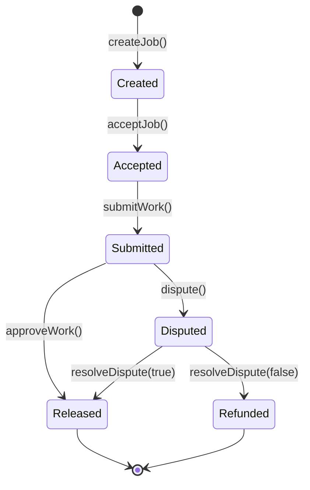
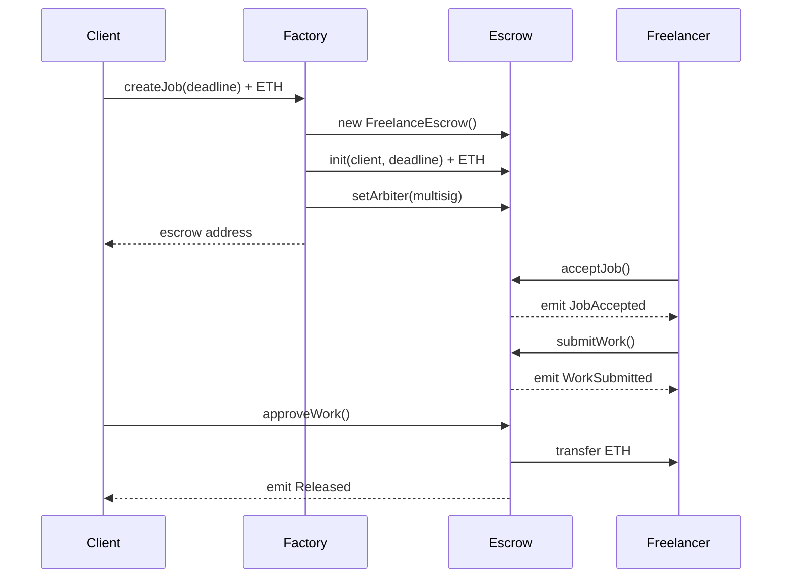
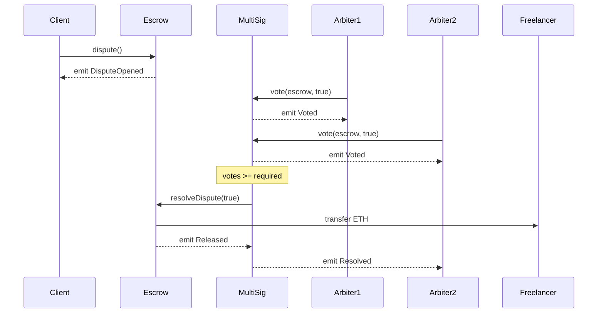

# SƠ ĐỒ LUỒNG HOẠT ĐỘNG HỆ THỐNG TRUSTLANCE

## 1. Sơ đồ tổng quan kiến trúc hệ thống

```
┌─────────────────────────────────────────────────────────────────────────────┐
│                              FRONTEND (React)                                │
│  ┌─────────────┐  ┌─────────────┐  ┌─────────────┐  ┌─────────────────────┐ │
│  │  CreateJob  │  │   JobList   │  │  JobDetail  │  │    ArbiterPanel     │ │
│  └──────┬──────┘  └──────┬──────┘  └──────┬──────┘  └──────────┬──────────┘ │
│         │                │                │                     │            │
│         └────────────────┴────────────────┴─────────────────────┘            │
│                                    │                                         │
│                          ┌─────────▼─────────┐                               │
│                          │    Ethers.js      │                               │
│                          │  (lib/contracts)  │                               │
│                          └─────────┬─────────┘                               │
└────────────────────────────────────┼─────────────────────────────────────────┘
                                     │
                          ┌──────────▼──────────┐
                          │      MetaMask       │
                          │   (Web3 Provider)   │
                          └──────────┬──────────┘
                                     │
═══════════════════════════════════════════════════════════════════════════════
                              ETHEREUM BLOCKCHAIN
═══════════════════════════════════════════════════════════════════════════════
                                     │
        ┌────────────────────────────┼────────────────────────────┐
        │                            │                            │
        ▼                            ▼                            ▼
┌───────────────┐          ┌─────────────────┐          ┌─────────────────┐
│EscrowFactory  │◄─────────│FreelanceEscrow  │─────────►│DisputeMultiSig  │
│               │  creates  │   (mỗi job)     │  arbiter │                 │
│ - createJob() │          │                 │          │ - vote()        │
│ - getAllJobs()│          │ - acceptJob()   │          │ - getVotes()    │
│ - getJob()    │          │ - submitWork()  │          │ - hasVoted()    │
└───────────────┘          │ - approveWork() │          │ - getArbiters() │
                           │ - dispute()     │          └─────────────────┘
                           │ - resolveDispute│
                           └─────────────────┘
```

---

## 2. Sơ đồ trạng thái (State Diagram) của Escrow

```
                                    ┌─────────────┐
                                    │   START     │
                                    └──────┬──────┘
                                           │
                                           │ Client gọi Factory.createJob()
                                           │ {value: amount}
                                           ▼
                               ┌───────────────────────┐
                               │       CREATED         │
                               │   (Status = 0)        │
                               │                       │
                               │ • ETH đã được khóa    │
                               │ • Chờ freelancer      │
                               └───────────┬───────────┘
                                           │
                                           │ Freelancer gọi acceptJob()
                                           │ emit JobAccepted(freelancer)
                                           ▼
                               ┌───────────────────────┐
                               │       ACCEPTED        │
                               │   (Status = 1)        │
                               │                       │
                               │ • Freelancer đang     │
                               │   thực hiện công việc │
                               └───────────┬───────────┘
                                           │
                                           │ Freelancer gọi submitWork()
                                           │ emit WorkSubmitted()
                                           ▼
                               ┌───────────────────────┐
                               │       SUBMITTED       │
                               │   (Status = 2)        │
                               │                       │
                               │ • Chờ client review   │
                               └───────────┬───────────┘
                                           │
                      ┌────────────────────┴────────────────────┐
                      │                                         │
                      │ Client gọi                              │ Client gọi
                      │ approveWork()                           │ dispute()
                      │                                         │ emit DisputeOpened()
                      ▼                                         ▼
          ┌───────────────────────┐               ┌───────────────────────┐
          │       RELEASED        │               │       DISPUTED        │
          │   (Status = 4)        │               │   (Status = 3)        │
          │                       │               │                       │
          │ • ETH → Freelancer    │               │ • Chờ trọng tài       │
          │ emit Released()       │               │   bỏ phiếu            │
          │                       │               └───────────┬───────────┘
          │       ✅ END          │                           │
          └───────────────────────┘                           │
                                               Arbiters vote qua MultiSig
                                        ┌──────────────┴──────────────┐
                                        │                             │
                                        │ resolveDispute(true)        │ resolveDispute(false)
                                        │ Freelancer thắng            │ Client thắng
                                        ▼                             ▼
                            ┌───────────────────┐         ┌───────────────────┐
                            │     RELEASED      │         │     REFUNDED      │
                            │   (Status = 4)    │         │   (Status = 5)    │
                            │                   │         │                   │
                            │ • ETH → Freelancer│         │ • ETH → Client    │
                            │ emit Released()   │         │ emit Refunded()   │
                            │                   │         │                   │
                            │      ✅ END       │         │      ✅ END       │
                            └───────────────────┘         └───────────────────┘
```

---

## 3. Sơ đồ tuần tự (Sequence Diagram) - Luồng bình thường

```
┌──────┐         ┌─────────┐         ┌──────────┐         ┌────────────────┐
│Client│         │Factory  │         │Escrow    │         │   Blockchain   │
└──┬───┘         └────┬────┘         └────┬─────┘         └───────┬────────┘
   │                  │                   │                       │
   │  createJob(deadline)                 │                       │
   │  {value: 1 ETH}  │                   │                       │
   │─────────────────►│                   │                       │
   │                  │                   │                       │
   │                  │  new FreelanceEscrow()                    │
   │                  │──────────────────►│                       │
   │                  │                   │                       │
   │                  │  init(client, deadline)                   │
   │                  │  {value: 1 ETH}   │                       │
   │                  │──────────────────►│                       │
   │                  │                   │   Store state         │
   │                  │                   │──────────────────────►│
   │                  │                   │                       │
   │                  │  setArbiter(multisig)                     │
   │                  │──────────────────►│                       │
   │                  │                   │                       │
   │                  │  emit JobCreated(escrow, client, amount, deadline)
   │                  │───────────────────────────────────────────►
   │                  │                   │                       │
   │◄─────────────────│                   │                       │
   │  return escrowAddr                   │                       │
   │                  │                   │                       │
```

---

## 4. Sơ đồ tuần tự - Luồng làm việc Freelancer

```
┌──────────┐                              ┌──────────┐         ┌────────────────┐
│Freelancer│                              │ Escrow   │         │   Blockchain   │
└────┬─────┘                              └────┬─────┘         └───────┬────────┘
     │                                         │                       │
     │  acceptJob()                            │                       │
     │────────────────────────────────────────►│                       │
     │                                         │                       │
     │                                         │  require(status == Created)
     │                                         │  require(freelancer == 0)
     │                                         │                       │
     │                                         │  freelancer = msg.sender
     │                                         │  status = Accepted    │
     │                                         │──────────────────────►│
     │                                         │                       │
     │                                         │  emit JobAccepted(freelancer)
     │                                         │──────────────────────►│
     │◄────────────────────────────────────────│                       │
     │  ✅ Transaction confirmed               │                       │
     │                                         │                       │
     │                                         │                       │
     │  ═══════ Freelancer làm việc ═══════   │                       │
     │                                         │                       │
     │                                         │                       │
     │  submitWork()                           │                       │
     │────────────────────────────────────────►│                       │
     │                                         │                       │
     │                                         │  require(status == Accepted)
     │                                         │  require(msg.sender == freelancer)
     │                                         │                       │
     │                                         │  status = Submitted   │
     │                                         │──────────────────────►│
     │                                         │                       │
     │                                         │  emit WorkSubmitted() │
     │                                         │──────────────────────►│
     │◄────────────────────────────────────────│                       │
     │  ✅ Transaction confirmed               │                       │
     │                                         │                       │
```

---

## 5. Sơ đồ tuần tự - Client chấp nhận công việc

```
┌──────┐                                  ┌──────────┐         ┌────────────────┐
│Client│                                  │ Escrow   │         │   Blockchain   │
└──┬───┘                                  └────┬─────┘         └───────┬────────┘
   │                                           │                       │
   │  approveWork()                            │                       │
   │──────────────────────────────────────────►│                       │
   │                                           │                       │
   │                                           │  require(status == Submitted)
   │                                           │  require(msg.sender == client)
   │                                           │                       │
   │                                           │  status = Released    │
   │                                           │──────────────────────►│
   │                                           │                       │
   │                                           │  _payFreelancer()     │
   │                                           │  ┌────────────────────┤
   │                                           │  │ freelancer.call    │
   │                                           │  │ {value: amount}    │
   │                                           │  │                    │
   │                                           │  │      ETH Transfer  │
   │                                           │  │───────────────────►│
   │                                           │  │                    │
   │                                           │  └────────────────────┤
   │                                           │                       │
   │                                           │  emit Released(freelancer, amount)
   │                                           │──────────────────────►│
   │◄──────────────────────────────────────────│                       │
   │  ✅ Transaction confirmed                 │                       │
   │                                           │                       │
   │                                           │                       │
   ▼                                           ▼                       ▼
┌──────────────────────────────────────────────────────────────────────────────┐
│                        💰 ETH đã được chuyển cho Freelancer                   │
└──────────────────────────────────────────────────────────────────────────────┘
```

---

## 6. Sơ đồ tuần tự - Luồng tranh chấp (Dispute Flow)

```
┌──────┐    ┌──────────┐    ┌──────────┐    ┌──────────┐    ┌────────────────┐
│Client│    │ Escrow   │    │ MultiSig │    │ Arbiters │    │   Blockchain   │
└──┬───┘    └────┬─────┘    └────┬─────┘    └────┬─────┘    └───────┬────────┘
   │             │               │               │                  │
   │ dispute()   │               │               │                  │
   │────────────►│               │               │                  │
   │             │               │               │                  │
   │             │ status = Disputed             │                  │
   │             │───────────────────────────────────────────────────►
   │             │               │               │                  │
   │             │ emit DisputeOpened()          │                  │
   │             │───────────────────────────────────────────────────►
   │◄────────────│               │               │                  │
   │ ✅ Confirmed│               │               │                  │
   │             │               │               │                  │
   │═════════════════════════ ARBITRATION PHASE ════════════════════│
   │             │               │               │                  │
   │             │               │ vote(escrow, true)               │
   │             │               │◄──────────────│ Arbiter 1        │
   │             │               │               │                  │
   │             │               │ votesForFreelancer++             │
   │             │               │──────────────────────────────────►
   │             │               │               │                  │
   │             │               │ emit Voted(escrow, arbiter1, true)
   │             │               │──────────────────────────────────►
   │             │               │               │                  │
   │             │               │ vote(escrow, true)               │
   │             │               │◄──────────────│ Arbiter 2        │
   │             │               │               │                  │
   │             │               │ votesForFreelancer++ (= 2 = required)
   │             │               │──────────────────────────────────►
   │             │               │               │                  │
   │             │               │ emit Voted(escrow, arbiter2, true)
   │             │               │──────────────────────────────────►
   │             │               │               │                  │
   │             │               │═══════ THRESHOLD REACHED ════════│
   │             │               │               │                  │
   │             │ resolveDispute(true)          │                  │
   │             │◄──────────────│               │                  │
   │             │               │               │                  │
   │             │ status = Released             │                  │
   │             │───────────────────────────────────────────────────►
   │             │               │               │                  │
   │             │ _payFreelancer()              │                  │
   │             │ ┌─────────────────────────────────────────────────┤
   │             │ │        ETH Transfer to Freelancer              │
   │             │ │────────────────────────────────────────────────►│
   │             │ └─────────────────────────────────────────────────┤
   │             │               │               │                  │
   │             │ emit Released(freelancer, amount)                │
   │             │───────────────────────────────────────────────────►
   │             │               │               │                  │
   │             │               │ emit Resolved(escrow, true)      │
   │             │               │──────────────────────────────────►
   │             │               │               │                  │
   ▼             ▼               ▼               ▼                  ▼
┌──────────────────────────────────────────────────────────────────────────────┐
│              🏆 TRANH CHẤP ĐÃ GIẢI QUYẾT - Freelancer nhận tiền              │
└──────────────────────────────────────────────────────────────────────────────┘
```

---

## 7. Sơ đồ luồng dữ liệu Frontend ↔ Blockchain

```
┌─────────────────────────────────────────────────────────────────────────────┐
│                               USER INTERFACE                                 │
├─────────────────────────────────────────────────────────────────────────────┤
│                                                                             │
│  ┌─────────────────┐    ┌─────────────────┐    ┌─────────────────────────┐  │
│  │   Connect Btn   │    │  Create Job     │    │      Job Actions        │  │
│  │                 │    │                 │    │                         │  │
│  │ onClick ────────┼───►│ amount, deadline│───►│ accept/submit/approve/  │  │
│  │                 │    │                 │    │ dispute/vote            │  │
│  └────────┬────────┘    └────────┬────────┘    └────────────┬────────────┘  │
│           │                      │                          │               │
└───────────┼──────────────────────┼──────────────────────────┼───────────────┘
            │                      │                          │
            ▼                      ▼                          ▼
┌───────────────────────────────────────────────────────────────────────────────┐
│                              REACT STATE                                       │
│  ┌────────────┐  ┌────────────┐  ┌────────────┐  ┌────────────┐  ┌──────────┐ │
│  │   signer   │  │  address   │  │   jobs[]   │  │selectedJob │  │ arbiters │ │
│  │            │  │            │  │            │  │            │  │          │ │
│  │ useState() │  │ useState() │  │ useState() │  │ useState() │  │useState()│ │
│  └─────┬──────┘  └─────┬──────┘  └─────┬──────┘  └─────┬──────┘  └────┬─────┘ │
│        │               │               │               │               │      │
└────────┼───────────────┼───────────────┼───────────────┼───────────────┼──────┘
         │               │               │               │               │
         ▼               ▼               ▼               ▼               ▼
┌───────────────────────────────────────────────────────────────────────────────┐
│                           LIB/CONTRACTS.JS                                     │
│                                                                               │
│   getFactory(signer)      getEscrow(addr, runner)      getMultiSig(runner)   │
│         │                        │                            │               │
│         │    new ethers.Contract(address, ABI, runner)        │               │
│         │                        │                            │               │
└─────────┼────────────────────────┼────────────────────────────┼───────────────┘
          │                        │                            │
          ▼                        ▼                            ▼
┌───────────────────────────────────────────────────────────────────────────────┐
│                              ETHERS.JS v6                                      │
│                                                                               │
│  ┌─────────────────┐    ┌─────────────────┐    ┌─────────────────┐           │
│  │ BrowserProvider │───►│     Signer      │───►│    Contract     │           │
│  │ (window.ethereum│    │ (signs txs)     │    │  (read/write)   │           │
│  └─────────────────┘    └─────────────────┘    └─────────────────┘           │
│                                                                               │
└───────────────────────────────────────────────────────────────────────────────┘
                                     │
                                     │ JSON-RPC
                                     ▼
┌───────────────────────────────────────────────────────────────────────────────┐
│                               METAMASK                                         │
│                                                                               │
│  ┌──────────────┐    ┌──────────────┐    ┌──────────────┐                    │
│  │  Account     │    │   Sign TX    │    │  Send TX     │                    │
│  │  Management  │    │   Request    │    │  to Network  │                    │
│  └──────────────┘    └──────────────┘    └──────────────┘                    │
│                                                                               │
└───────────────────────────────────────────────────────────────────────────────┘
                                     │
                                     │ eth_sendRawTransaction
                                     ▼
═══════════════════════════════════════════════════════════════════════════════
                         ETHEREUM NETWORK (Hardhat Local)
═══════════════════════════════════════════════════════════════════════════════
```

---

## 8. Bảng tổng hợp Events và mục đích sử dụng

| Contract | Event | Tham số | Mục đích |
|----------|-------|---------|----------|
| **EscrowFactory** | `JobCreated` | `escrow`, `client`, `amount`, `deadline`, `timestamp` | Frontend index danh sách jobs |
| **FreelanceEscrow** | `JobAccepted` | `freelancer` | Thông báo có người nhận việc |
| **FreelanceEscrow** | `WorkSubmitted` | - | Thông báo công việc đã được nộp |
| **FreelanceEscrow** | `DisputeOpened` | - | Kích hoạt chế độ tranh chấp |
| **FreelanceEscrow** | `Released` | `freelancer`, `amount` | Xác nhận thanh toán thành công |
| **FreelanceEscrow** | `Refunded` | `client`, `amount` | Xác nhận hoàn tiền thành công |
| **DisputeMultiSig** | `Voted` | `escrow`, `arbiter`, `payFreelancer` | Theo dõi lịch sử bỏ phiếu |
| **DisputeMultiSig** | `Resolved` | `escrow`, `payFreelancer` | Thông báo kết quả tranh chấp |

---

## 9. Sơ đồ quan hệ giữa các hàm (Function Call Graph)

```
                              ┌─────────────────┐
                              │     CLIENT      │
                              └────────┬────────┘
                                       │
              ┌────────────────────────┼────────────────────────┐
              │                        │                        │
              ▼                        ▼                        ▼
    ┌─────────────────┐      ┌─────────────────┐      ┌─────────────────┐
    │ Factory.        │      │ Escrow.         │      │ Escrow.         │
    │ createJob()     │      │ approveWork()   │      │ dispute()       │
    └────────┬────────┘      └────────┬────────┘      └────────┬────────┘
             │                        │                        │
             ▼                        ▼                        │
    ┌─────────────────┐      ┌─────────────────┐               │
    │ new Escrow()    │      │ _payFreelancer()│               │
    └────────┬────────┘      └─────────────────┘               │
             │                                                  │
             ▼                                                  │
    ┌─────────────────┐                                        │
    │ Escrow.init()   │                                        │
    └────────┬────────┘                                        │
             │                                                  │
             ▼                                                  │
    ┌─────────────────┐                                        │
    │ Escrow.         │                                        │
    │ setArbiter()    │                                        │
    └─────────────────┘                                        │
                                                               │
                              ┌─────────────────┐              │
                              │   FREELANCER    │              │
                              └────────┬────────┘              │
                                       │                       │
              ┌────────────────────────┤                       │
              │                        │                       │
              ▼                        ▼                       │
    ┌─────────────────┐      ┌─────────────────┐              │
    │ Escrow.         │      │ Escrow.         │              │
    │ acceptJob()     │      │ submitWork()    │              │
    └─────────────────┘      └─────────────────┘              │
                                                               │
                                                               │
                              ┌─────────────────┐              │
                              │    ARBITERS     │◄─────────────┘
                              └────────┬────────┘
                                       │
                                       ▼
                             ┌─────────────────┐
                             │ MultiSig.vote() │
                             └────────┬────────┘
                                      │
                      ┌───────────────┴───────────────┐
                      │ if votes >= required          │
                      ▼                               │
             ┌─────────────────┐                      │
             │ Escrow.         │                      │
             │ resolveDispute()│                      │
             └────────┬────────┘                      │
                      │                               │
         ┌────────────┴────────────┐                  │
         │                         │                  │
         ▼                         ▼                  │
┌─────────────────┐      ┌─────────────────┐         │
│ _payFreelancer()│      │ _refundClient() │         │
│ (if true)       │      │ (if false)      │         │
└─────────────────┘      └─────────────────┘         │
```

---

## 10. Mermaid Diagrams (Dùng cho GitHub/GitLab)

### 10.1 State Diagram



### 10.2 Sequence Diagram - Happy Path



### 10.3 Sequence Diagram - Dispute Flow



---

*Các sơ đồ trên mô tả đầy đủ luồng hoạt động, lời gọi hàm và sự kiện trong hệ thống TrustLance.*

